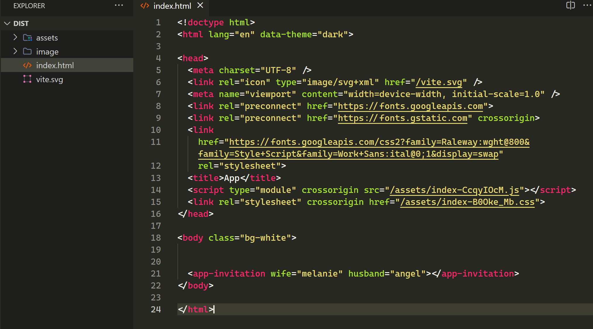
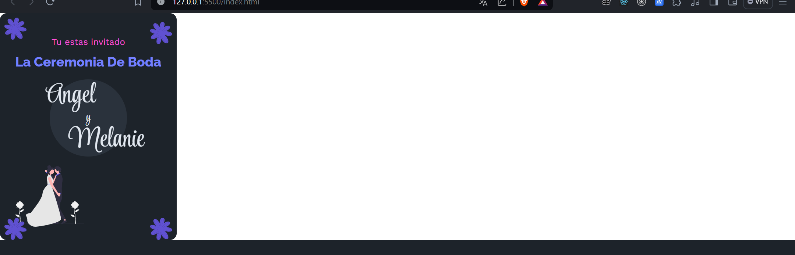

# Convetir Componentes de React a Web Components

## Para descargar el proyecto

Instalar [NodeJS](https://nodejs.org/en) en su version LTS

Despues instalar la dependencias
```
npm install
```


## ¿Cómo utilizar mis WebComponentes en mi archivo html?

ejecute el comando 
```
npm run install
```

abra la carpeta `dist` en una nueva pestaña de `visual studio code`


### Componente Ejemplo

Para utilizar el componente que se utilizo tiene el nombre de `<app-invitation></app-invitation>` y como atributos del componente recibe:

* `wife`: el nombre de la esposa de la invitacion
* `husband`: el nombre del esposo de la invitacion

**Nota**: Si no se le pasan dichas propiedades tiene valores por defecto de "esposa" y "esposa"


Una vez abierto la carpeta dist en otra nueva pestaña de **visutal studio code** se coloca el componente y a travez de la extension de **live server** del IDE se muestra la pagina

## Código



## Renderizado



# ¿Que libreria se utilizo para convertir los compoentes?
[Consulte aqui](https://github.com/bitovi/react-to-web-component) para checar mas a fondo la documentación mas a fondo


